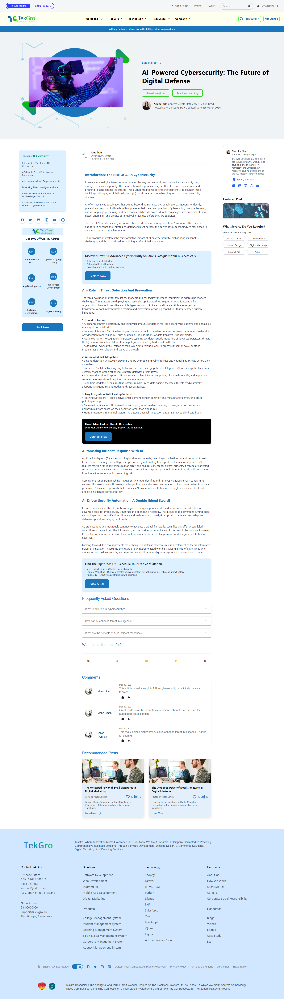

# Tekgro Homepage and Blog Site  

This is a React-based homepage and blog site developed using modular architecture, Tailwind CSS, Material-UI (MUI), and Vite. The project is built with a focus on reusable components to ensure maintainability and scalability.

## Features  
- **Homepage**: A modern homepage following the provoded Figma file.  
- **Blog Page**: A dedicated blog page accessible via `/blog`.  
- **Technologies Used**:  
  - React  
  - Tailwind CSS  
  - Material-UI (MUI)  
  - Vite  
  - Modular Architecture  

---

## Screenshots  
### Homepage  
  

### Blog Page  
  

---

## Installation and Usage  

1. **Clone the Project**  
   ```bash  
   git clone <repository-url>  
   cd <project-directory>  
   ```  

2. **Install Dependencies**  
   ```bash  
   npm install  
   ```  

3. **Run the Development Server**  
   ```bash  
   npm run dev  
   ```  

4. **Access the Application**  
   - Open your browser and navigate to `http://localhost:5173/` for the homepage.  
   - To visit the blog, go to `http://localhost:5173/blog`.  
